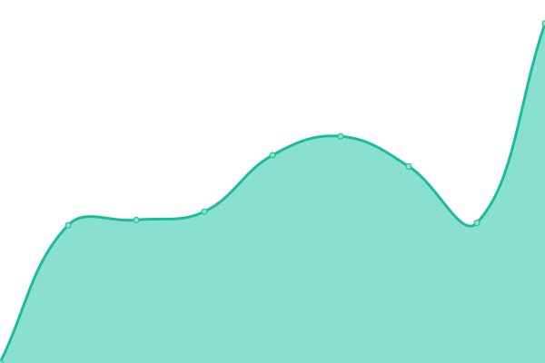

# [📈 Live Status](https://demo.upptime.js.org): <!--live status--> **🟩 All systems operational**

This repository contains the open-source uptime monitor and status page for [Upptime](https://upptime.js.org), powered by [Upptime](https://github.com/upptime/upptime).

With [Upptime](https://upptime.js.org), you can get your own unlimited and free uptime monitor and status page, powered entirely by a GitHub repository. We use [Issues](https://github.com/upptime/upptime/issues) as incident reports, [Actions](https://github.com/chatainsim/upptime/actions) as uptime monitors, and [Pages](https://demo.upptime.js.org) for the status page.

<!--start: status pages-->
<!-- This summary is generated by Upptime (https://github.com/upptime/upptime) -->
<!-- Do not edit this manually, your changes will be overwritten -->
<!-- prettier-ignore -->
| URL | Status | History | Response Time | Uptime |
| --- | ------ | ------- | ------------- | ------ |
|  [Yach](https://yachman.duckdns.org) | 🟩 Up | [yach.yml](https://github.com/chatainsim/upptime/commits/HEAD/history/yach.yml) | 

 476ms
     
 | 

<a href="https://chatainsim.github.io/upptime/history/yach">100.00%</a>
    

|  [Domo Easter](https://domo.easter.fr) | 🟩 Up | [domo-easter.yml](https://github.com/chatainsim/upptime/commits/HEAD/history/domo-easter.yml) | 

 3659ms
     
 | 

<a href="https://chatainsim.github.io/upptime/history/domo-easter">100.00%</a>
    

|  [Gite du Galli](https://gite-du-galli.fr) | 🟩 Up | [gite-du-galli.yml](https://github.com/chatainsim/upptime/commits/HEAD/history/gite-du-galli.yml) | 

 1111ms
     
 | 

<a href="https://chatainsim.github.io/upptime/history/gite-du-galli">100.00%</a>
    

|  [Box](https://box.easter.fr) | 🟩 Up | [box.yml](https://github.com/chatainsim/upptime/commits/HEAD/history/box.yml) | 

 1004ms
     
 | 

<a href="https://chatainsim.github.io/upptime/history/box">100.00%</a>
    

|  [Cloud](https://cloud.easter.fr) | 🟩 Up | [cloud.yml](https://github.com/chatainsim/upptime/commits/HEAD/history/cloud.yml) | 

 1206ms
     
 | 

<a href="https://chatainsim.github.io/upptime/history/cloud">97.88%</a>
    

|  [TT-RSS](https://ttrss.easter.fr/) | 🟩 Up | [tt-rss.yml](https://github.com/chatainsim/upptime/commits/HEAD/history/tt-rss.yml) | 

 926ms
     
 | 

<a href="https://chatainsim.github.io/upptime/history/tt-rss">100.00%</a>
    

<!--end: status pages-->

[**Visit our status website →**](https://demo.upptime.js.org)

## 📄 License

- Powered by: [Upptime](https://github.com/upptime/upptime)
- Code: [MIT](./LICENSE) © [Upptime](https://upptime.js.org)
- Data in the `./history` directory: [Open Database License](https://opendatacommons.org/licenses/odbl/1-0/)
